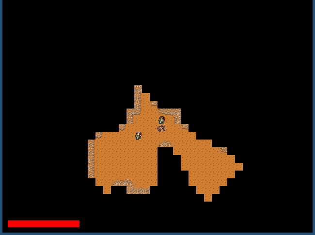

# rRpg - A Rogue like Role Playing Game

## Screenshots



## Dependancies

Requires:

* SDL2
* SDL2_image
* squashfs-tools

## Compilation

	make full

To compile for the GCW-zero, you need the toolchain (downloadable from the
console's website), then:

	make gcw CROSS_COMPILE=/opt/gcw0-toolchain/usr/bin/mipsel-linux-

To package for the gcw zero, you will need the package squashfs-tools, then run

	make opk

Finally, to use your opk, copy it in your GCW-Zero. I use scp for that, but via
ftp or on a memory card should work as well:

	scp rrpg.opk root@[gcwIp]:/media/data/apps/

## How to play

To start the game, run the executable ```./bin/rrpg```.

### PC controls

* arrows to move the character
* move toward as enemy to attack it
* escape to exit

### GCW-Zero controls

* D-Pad to move the character
* move toward as enemy to attack it
* select to exit

## Credits

Sprites from the great collection [DawnLike](https://opengameart.org/content/dawnlike-16x16-universal-rogue-like-tileset-v181)
